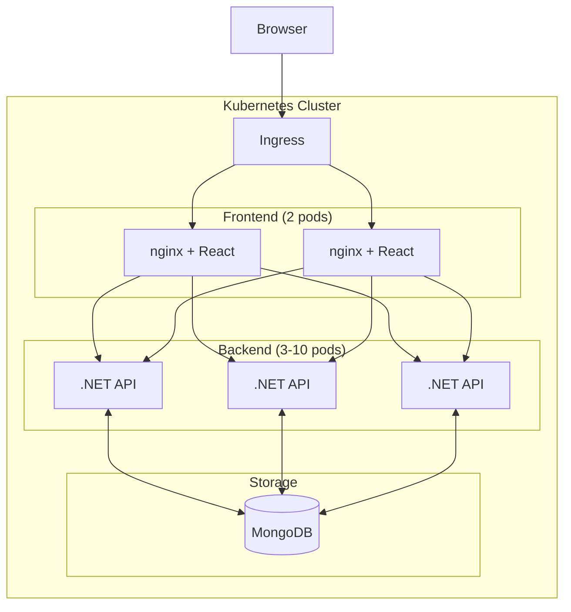

# SSE Realtime Demo

> **⚠️ DEMO APPLICATION - NOT FOR PRODUCTION**  
> Hardcoded credentials for easy setup. See [SECURITY.md](./SECURITY.md).

Server-Sent Events (SSE) implementation with .NET 9.0, React, and Kubernetes. Demonstrates distributed real-time event streaming with MongoDB outbox pattern.

## Features

- **Distributed SSE** with MongoDB outbox pattern
- **Kubernetes-native** with horizontal scaling (3-10 pods)
- **Event filtering** at connection level
- **Typed events** with schema validation
- **Automatic reconnection** and deduplication
- **API key authentication**

## Quick Start

```bash
# Prerequisites: Docker Desktop with Kubernetes, kubectl, Nginx Ingress
echo '127.0.0.1 sse-demo.local' | sudo tee -a /etc/hosts

# Deploy
git clone https://github.com/mdarapour/sse-realtime-demo.git
cd sse-realtime-demo
./deploy-k8s.sh

# Access
open http://sse-demo.local
```

See [Quick Start Guide](docs/QUICK_START.md) for details.

## Architecture



## API Endpoints

### SSE Connection
```bash
GET /api/sse/connect?clientId={id}&filter={eventType}&apikey={key}
```

### Event Broadcasting
```bash
POST /api/sse/broadcast
POST /api/sse/notification
POST /api/sse/alert
POST /api/sse/data-update
POST /api/sse/heartbeat
```

### Demo Control
```bash
POST /api/demo/start
POST /api/demo/stop
GET  /api/demo/status
```

## Key Components

### Backend
- `SseService.cs` - Manages connections and event distribution
- `SseOutboxService.cs` - MongoDB outbox pattern for cross-pod events
- `SseMessageService.cs` - Typed event creation
- `ApiKeyAuthenticationHandler.cs` - API key validation

### Frontend
- `useSse()` - React hook for SSE connections
- `useSseTyped()` - Typed event handling
- `SseService.ts` - EventSource wrapper with reconnection

## Event Flow

1. Client connects via Ingress → Backend pod
2. Events published to MongoDB outbox
3. Each pod polls outbox for new events
4. Events delivered to local clients based on filters

## Examples

```typescript
// Frontend - Connect with filter
const { events, status } = useSse({
  url: '/api/sse/connect',
  filter: 'notification',
  apiKey: 'demo-api-key-12345'
});

// Backend - Send typed event
_messageService.SendNotificationToAll(
  "System update complete", 
  "info"
);
```

## Documentation

- [SSE Best Practices](docs/SSE_BEST_PRACTICES.md) - Patterns and implementation guide
- [Use Cases](docs/USE_CASES.md) - Real-world examples
- [Quick Start](docs/QUICK_START.md) - Setup instructions

## License

MIT - See [LICENSE](LICENSE)