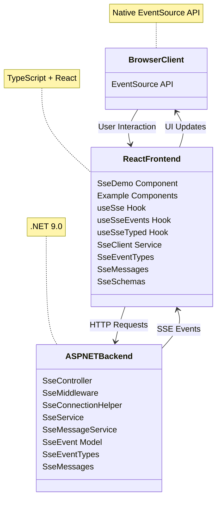
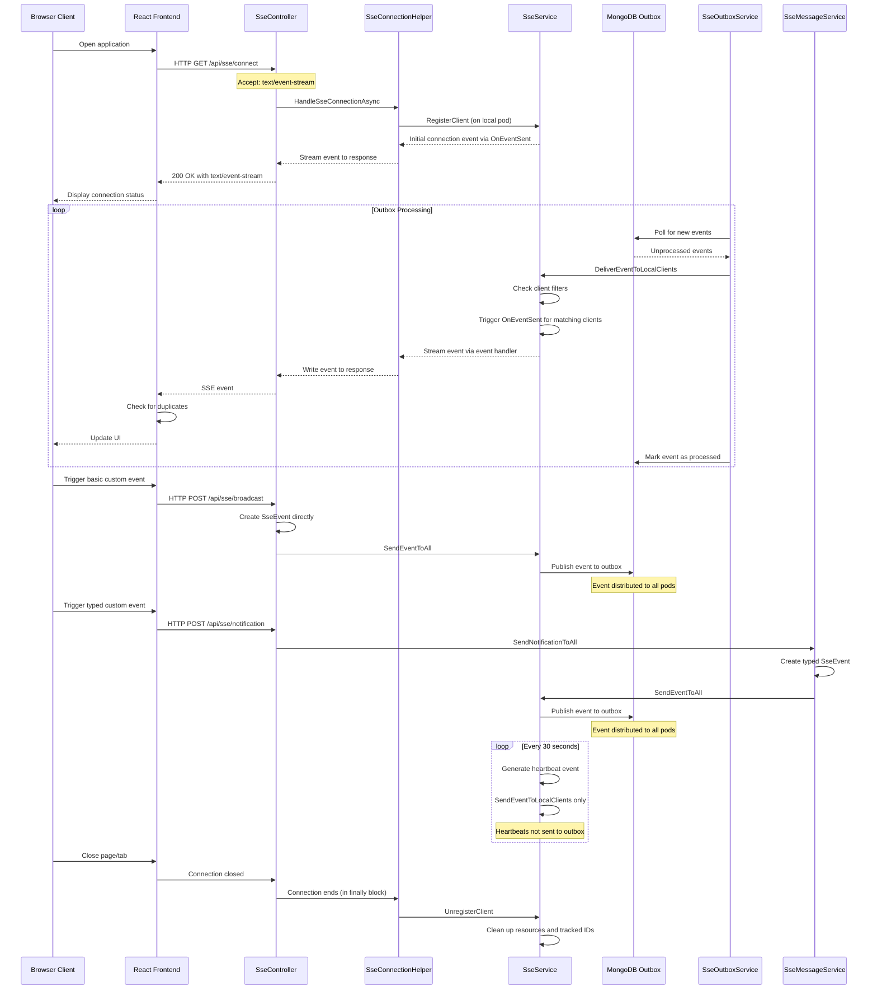
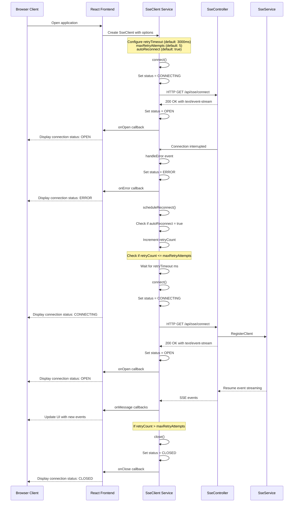
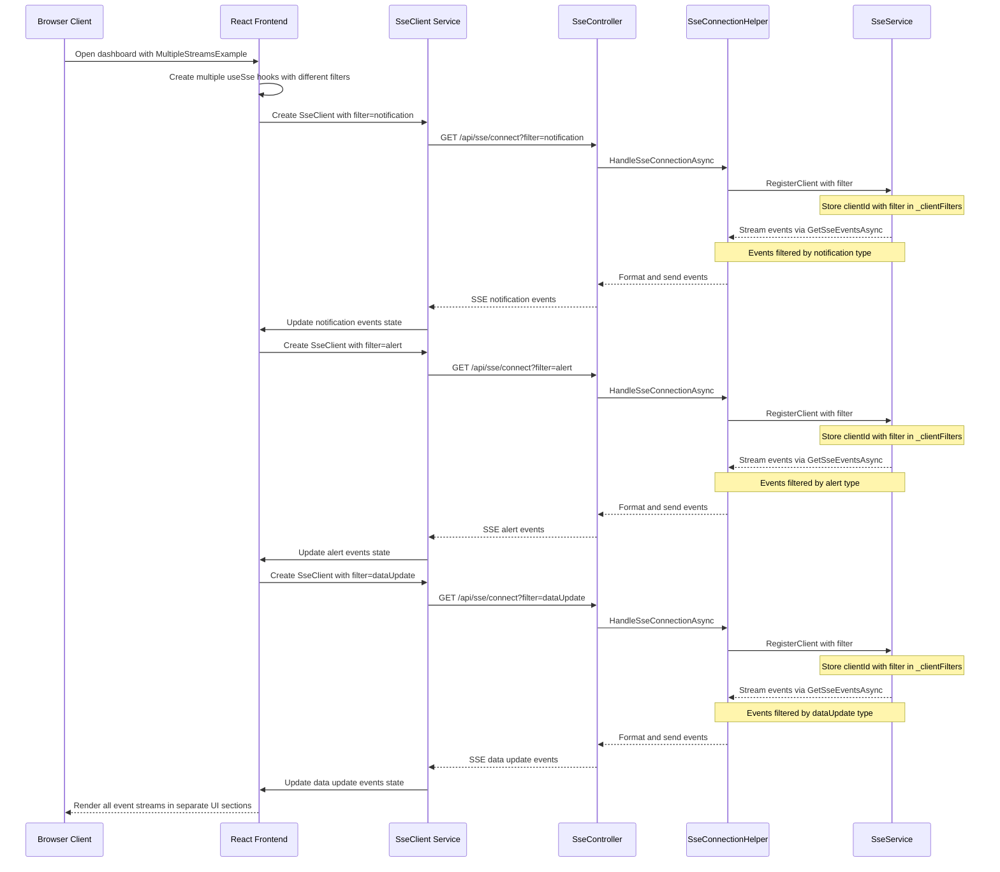
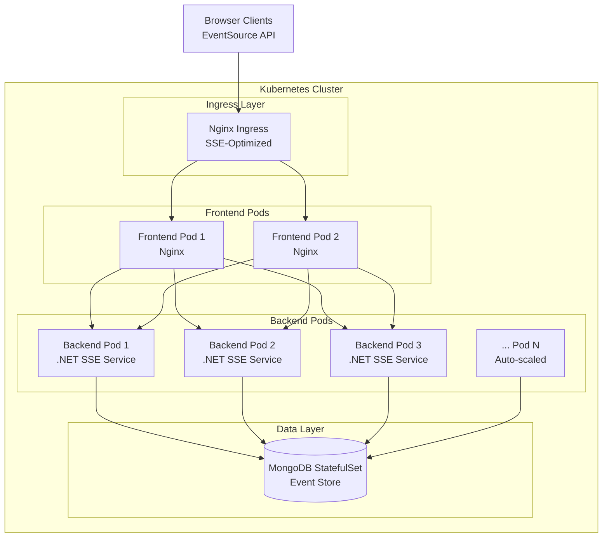

# SSE Realtime Demo

> **⚠️ DEMO APPLICATION - NOT FOR PRODUCTION USE ⚠️**  
> This is a demonstration application for learning Server-Sent Events (SSE) with distributed architecture. It contains hardcoded credentials and simplified security for ease of use in development environments. See [SECURITY.md](./SECURITY.md) for details.

A comprehensive demonstration of Server-Sent Events (SSE) implementation with React, .NET 9.0, and Kubernetes scaling capabilities.

## Overview

This sample application demonstrates how to implement Server-Sent Events (SSE) using TypeScript and React for the frontend and C# (.NET 9.0) for the backend. It showcases various SSE features, patterns, and best practices for building scalable real-time applications.

🚀 **[Quick Start Guide](docs/QUICK_START.md)** - Get up and running in under 5 minutes!

## What are Server-Sent Events (SSE)?

Server-Sent Events (SSE) is a web technology that enables servers to push real-time updates to clients over a single HTTP connection. Unlike traditional HTTP requests where clients poll the server for updates, SSE establishes a persistent connection that allows servers to proactively send data to clients whenever new information is available.

📚 **See [Real-World Use Cases and Examples](docs/USE_CASES.md)** for practical applications including live dashboards, notifications, progress tracking, and more.

### How SSE Works

Server-Sent Events operate through a simple yet effective process. The client first initiates a standard HTTP request to a server endpoint with the header `Accept: text/event-stream`. The server then keeps this connection open and responds with a content type of `text/event-stream`, establishing a persistent channel. Through this open connection, the server can proactively send formatted text messages to the client at any time without requiring additional requests from the client. These messages follow a simple text format with fields like `event`, `data`, `id`, and `retry` to structure the information. One of SSE's key advantages is its built-in reconnection mechanism—if the connection is lost, the browser automatically attempts to reconnect, and can use the last received event ID to resume from where it left off, ensuring continuity of data.

### When to Use SSE

SSE is ideal for a variety of real-time application scenarios. It excels when applications need to display live updates such as dashboards, notifications, stock tickers, or news feeds. SSE is particularly well-suited for situations where information primarily flows from server to client in a one-way communication pattern. Developers often choose SSE when they need a simpler alternative to WebSockets or want to leverage existing HTTP infrastructure including proxies and load balancers. The technology's built-in automatic reconnection handling makes it valuable for maintaining persistent connections in unstable network environments. Additionally, SSE's support for event categorization provides significant benefits for applications that need to organize and process different types of real-time events efficiently.

### When Not to Use SSE

SSE may not be suitable when:

- **Bidirectional Communication**: Your application requires frequent client-to-server communication
- **Binary Data**: You need to transmit binary data efficiently
- **High-frequency Updates**: You need extremely high-frequency updates (thousands per second)
- **IE Support**: You need to support Internet Explorer (which doesn't support SSE natively)

## Implementation Best Practices

For comprehensive best practices, patterns, and production-ready implementation strategies, see our dedicated [**SSE Best Practices Guide**](docs/SSE_BEST_PRACTICES.md).

### Quick Reference

**Server-Side Essentials:**
- Implement connection tracking with cleanup
- Use event IDs for reconnection support
- Handle errors gracefully with proper status codes
- Optimize with async patterns and connection pooling

**Client-Side Essentials:**
- Implement reconnection with exponential backoff
- Use typed events with schema validation
- Detect and handle duplicate events
- Optimize UI updates for high-frequency events

**Production Considerations:**
- Monitor active connections and event throughput
- Implement proper authentication and rate limiting
- Scale horizontally with stateless design
- Use distributed event stores for multi-instance deployments

## Project Structure

The project consists of two main parts:

1. **Backend (C# ASP.NET Core on .NET 9.0)**
   - Located in the `backend` directory
   - Implements SSE endpoints and services
   - Uses the latest .NET framework with asynchronous programming

2. **Frontend (React + TypeScript)**
   - Located in the `frontend` directory
   - Demonstrates various SSE client implementations
   - Uses modern React hooks and TypeScript for type safety

## Features Demonstrated

- Basic SSE connection and event handling
- Reconnection strategies
- Standardized event types and formats
- Server-side event filtering
- Multiple concurrent event streams
- Custom event handling
- Robust error handling
- Duplicate event detection
- Consistent schema definitions between frontend and backend

## Key Benefits of Server-Sent Events (SSE)

- **Simplicity**: Uses standard HTTP, no need for special protocols
- **Native Browser Support**: Built into modern browsers via the EventSource API
- **Automatic Reconnection**: Browsers handle reconnection automatically
- **Text-Based**: Simple format makes debugging easier
- **Unidirectional**: Efficient for scenarios where server pushes data to clients
- **HTTP/2 Compatible**: Works well with HTTP/2 multiplexing
- **Firewall Friendly**: Uses standard HTTP port 80/443, no issues with firewalls
- **Event Types**: Supports named events for better organization

## SSE vs WebSockets

| Feature | Server-Sent Events (SSE) | WebSockets |
|---------|--------------------------|------------|
| **Communication** | One-way (server to client) | Two-way (full-duplex) |
| **Protocol** | HTTP | WebSocket protocol (WS/WSS) |
| **Reconnection** | Automatic | Manual implementation required |
| **Message Types** | Supports named events | Generic messaging |
| **Text/Binary** | Text only | Both text and binary |
| **Browser Support** | All modern browsers | All modern browsers |
| **Max Connections** | Limited by browser (6 per domain) | Higher limit |
| **Proxy Handling** | Works with standard proxies | May require special configuration |
| **Implementation** | Simpler | More complex |
| **Best For** | Notifications, updates, feeds | Chat, gaming, collaborative editing |

## Getting Started

🚀 **[Quick Start Guide](docs/QUICK_START.md)** - Get up and running in under 5 minutes!

**Important**: This demo requires Kubernetes for ALL development and testing. The architecture is designed for production-ready distributed systems and uses MongoDB for event distribution across pods.

The Quick Start Guide provides:
- Kubernetes deployment with Ingress (required)
- API testing examples
- Troubleshooting tips

## Backend Implementation Details

### Key Components

- **SseEvent.cs**: Model representing a Server-Sent Event
- **SseEventTypes.cs**: Standardized event type definitions
- **SseMessages.cs**: Message payload definitions with consistent schemas
- **SseService.cs**: Service for managing SSE connections and sending events
- **SseMessageService.cs**: Service for creating and sending typed messages
- **SseMiddleware.cs**: Middleware for handling SSE connections
- **SseController.cs**: Controller with endpoints for SSE connections and event broadcasting
- **SseConnectionHelper.cs**: Helper for handling SSE connections consistently

### SSE Endpoints

- `GET /api/sse/connect`: Establishes an SSE connection
  - Query parameters:
    - `clientId` (optional): Client identifier
    - `filter` (optional): Event type filter

- `POST /api/sse/broadcast`: Broadcasts an event to all connected clients
  - Request body:
    ```json
    {
      "eventType": "message",
      "data": "Event data"
    }
    ```

- `POST /api/sse/send/{clientId}`: Sends an event to a specific client
  - Request body:
    ```json
    {
      "eventType": "message",
      "data": "Event data"
    }
    ```

## Frontend Implementation Details

### Key Components

- **sseService.ts**: Client service for SSE connections
- **sseEventTypes.ts**: Standardized event type definitions matching backend
- **sseMessages.ts**: Message payload interfaces with consistent schemas
- **sseSchemas.ts**: Schema validation for SSE messages
- **useSse.ts**: Custom React hooks for using SSE in components
- **useSseTyped.ts**: Typed hooks for strongly-typed event handling
- **SseDemo.tsx**: Main demo component
- **Example components**: Various examples demonstrating different SSE patterns

### Custom Hooks

- **useSse**: Basic hook for SSE connections with duplicate detection
- **useSseEvents**: Advanced hook for typed events with filtering
- **useSseTyped**: Strongly-typed hook with schema validation

## Best Practices Demonstrated

1. **Connection Management**
   - Proper connection establishment and cleanup
   - Automatic and manual reconnection strategies
   - Connection status tracking
   - Consistent connection handling between middleware and controller

2. **Event Handling**
   - Strongly-typed event handling
   - Standardized event type definitions
   - Server-side and client-side event filtering
   - Custom event types with schema validation

3. **Error Handling**
   - Reconnection on error
   - Configurable retry attempts
   - Consistent error logging with appropriate severity levels
   - Proper error propagation

4. **Performance**
   - Efficient event streaming
   - Connection pooling on the server
   - Proper resource cleanup
   - Optimized logging

5. **Data Integrity**
   - Duplicate event detection and prevention
   - Consistent schema definitions between frontend and backend
   - Message ID tracking with automatic cleanup
   - Type-safe event handling

## Architecture and Flow Diagrams

### Component Architecture



## Sequence Diagrams

### SSE Connection and Event Flow (Distributed Architecture)



### Reconnection Strategy



### Multiple Concurrent Streams



## Consequences of Using SSE and Its Patterns

Adopting Server-Sent Events (SSE) as a real-time communication strategy has significant implications for application architecture, performance, and user experience:

1. **Architectural Implications**
   - Promotes event-driven architecture patterns throughout the application
   - Requires maintaining long-lived connections on the server, affecting scaling strategies
   - Encourages separation of concerns between data producers and consumers
   - May necessitate specialized infrastructure for high-availability deployments

2. **Performance Considerations**
   - Reduces network overhead compared to polling but increases server connection count
   - Connection limits (typically 6 per browser domain) may require domain sharding for multiple streams
   - Memory usage grows with the number of concurrent connections and event buffer sizes
   - Careful event filtering becomes essential to prevent overwhelming clients with irrelevant updates

3. **User Experience Effects**
   - Enables more responsive interfaces with immediate updates without page refreshes
   - Requires thoughtful UI patterns to handle connection status changes gracefully
   - May increase perceived application responsiveness but also raise expectations for freshness
   - Necessitates clear visual indicators for connection state and data synchronization status

4. **Development Complexity**
   - Introduces asynchronous programming patterns that can increase code complexity
   - Requires careful handling of reconnection logic and event deduplication
   - Demands consistent event schema management between frontend and backend
   - Creates potential for race conditions and out-of-order event processing

5. **Operational Considerations**
   - Increases the importance of monitoring connection counts and server resource usage
   - May require specialized load balancing configurations to maintain sticky sessions
   - Necessitates strategies for graceful degradation when connections fail
   - Creates new observability challenges for tracking event flow through the system

## Kubernetes Deployment and Scaling

This project includes a complete Kubernetes deployment configuration that demonstrates how to properly scale SSE services in a distributed environment.

### Architecture Overview

The Kubernetes deployment uses a stateless backend architecture with MongoDB as a central event store, enabling horizontal scaling without sticky sessions:



### Key Features for SSE at Scale

1. **Stateless Backend Design**
   - No session affinity required
   - Any pod can handle any SSE connection
   - Events distributed via MongoDB outbox pattern

2. **Horizontal Pod Autoscaling**
   - Minimum 3 replicas for high availability
   - Scales up to 10 replicas based on CPU/memory usage
   - Automatic scaling based on connection load

3. **SSE-Optimized Configuration**
   - Disabled proxy buffering at all layers
   - 24-hour connection timeouts
   - HTTP/1.1 protocol support
   - Proper handling of long-lived connections

### Deployment Instructions

1. **Prerequisites**
   - Kubernetes cluster (1.19+) with kubectl configured
   - Docker installed for building images
   - Nginx Ingress Controller installed
   - Host file entry for local development

2. **Install Nginx Ingress Controller** (if not already installed)
   ```bash
   # For Docker Desktop / Local Kubernetes
   kubectl apply -f https://raw.githubusercontent.com/kubernetes/ingress-nginx/controller-v1.8.2/deploy/static/provider/cloud/deploy.yaml
   
   # Wait for ingress controller to be ready
   kubectl wait --namespace ingress-nginx \
     --for=condition=ready pod \
     --selector=app.kubernetes.io/component=controller \
     --timeout=120s
   ```

3. **Configure Local DNS**
   ```bash
   # Add to /etc/hosts (Linux/Mac) or C:\Windows\System32\drivers\etc\hosts (Windows)
   echo "127.0.0.1 sse-demo.local" | sudo tee -a /etc/hosts
   ```

4. **Deploy the Application**
   ```bash
   # Use the deployment script
   ./deploy-k8s.sh
   ```

   The script will:
   - Build Docker images with Ingress URLs configured
   - Create the sse-demo namespace
   - Deploy MongoDB with persistent storage
   - Deploy 3 backend replicas with HPA (auto-scaling 3-10 pods)
   - Deploy 2 frontend replicas
   - Configure services and ingress for production-like setup

5. **Verify Deployment**
   ```bash
   # Check all resources
   kubectl get all,ingress -n sse-demo

   # Verify ingress has an address
   kubectl get ingress -n sse-demo
   # Should show ADDRESS as 'localhost' or an IP

   # Watch logs from all backend pods
   kubectl logs -f deploy/backend -n sse-demo --all-containers=true --prefix=true
   ```

6. **Access the Application**
   - Main URL: **http://sse-demo.local**
   - The application uses Ingress routing for production-like behavior
   - All API calls are proxied through the frontend nginx to the backend services
   
   **Troubleshooting Access Issues:**
   - Ensure Ingress Controller is running: `kubectl get pods -n ingress-nginx`
   - Verify ingress has ADDRESS: `kubectl get ingress -n sse-demo`
   - Check /etc/hosts has the entry: `cat /etc/hosts | grep sse-demo`
   - Hard refresh browser (Ctrl+F5 / Cmd+Shift+R) after deployment

5. **Test the Distributed Model**
   ```bash
   # Open multiple browser tabs to see events distributed across all clients
   
   # Send test event via any backend pod
   kubectl exec -it deploy/backend -n sse-demo -- curl -X POST http://localhost:8080/api/sse/broadcast \
     -H 'Content-Type: application/json' \
     -H 'X-API-Key: demo-api-key-12345' \
     -d '{"eventType": "notification", "data": "Test from pod"}'
   
   # Scale backend pods to test load distribution
   kubectl scale deploy/backend -n sse-demo --replicas=5
   ```

6. **Cleanup**
   ```bash
   kubectl delete namespace sse-demo
   ```

### Scaling Strategies

1. **Connection-Based Scaling**
   - Monitor active SSE connections per pod
   - Scale when connections exceed threshold
   - Consider connection limits per pod

2. **Event Throughput Scaling**
   - Monitor event processing rate
   - Scale based on event queue depth
   - Ensure MongoDB can handle write load

3. **Geographic Distribution**
   - Deploy across multiple regions
   - Use geo-aware load balancing
   - Consider event propagation latency

### Production Considerations

1. **Monitoring**
   - Track active connections per pod
   - Monitor event latency
   - Alert on connection errors
   - Use distributed tracing for event flow

2. **Resource Planning**
   - Each SSE connection consumes memory
   - Plan for peak concurrent connections
   - Consider connection limits per pod
   - Size MongoDB for event retention

3. **High Availability**
   - Multiple backend replicas
   - MongoDB replication
   - Cross-AZ deployment
   - Graceful shutdown handling

4. **Security**
   - API key authentication
   - TLS termination at ingress
   - Network policies for pod communication
   - Secrets management for credentials

### Troubleshooting

Common issues and solutions:

1. **Connections Dropping**
   - Check proxy timeout settings
   - Verify ingress annotations
   - Review pod resource limits

2. **Events Not Distributed**
   - Check MongoDB connectivity
   - Verify outbox service operation
   - Review backend logs

3. **Scaling Issues**
   - Check HPA metrics
   - Verify resource requests/limits
   - Review cluster capacity


## Contributing

We welcome contributions! Please see our [Contributing Guidelines](CONTRIBUTING.md) for details.

### Development Setup

1. Fork the repository
2. Create a feature branch
3. Make your changes
4. Run tests and linting
5. Submit a pull request

### Code Standards

- Follow existing code style
- Add tests for new features
- Update documentation
- Ensure all tests pass

## License

This project is licensed under the MIT License - see the [LICENSE](LICENSE) file for details.
